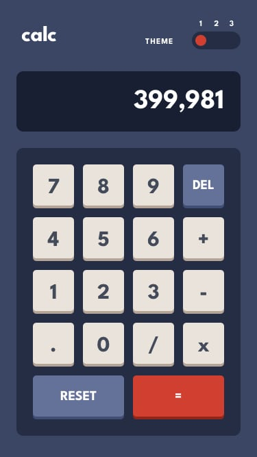

Calculator App Solution
=======================

This is my solution to the [Calculator app challenge on Frontend Mentor](https://www.frontendmentor.io/challenges/calculator-app-9lteq5N29).The goal of this project was not only to complete the UI, but to build a fully functional calculator from scratch using **Vanilla JavaScript**, focusing on state management and logic implementation without relying on eval().

Table of contents
-----------------

*   [Overview](#overview)
    
    *   [The challenge](#the-challenge)
        
    *   [Screenshot](#screenshot)
        
    *   [Links](#links)
        
*   [My process](#my-process)
    
    *   [Built with](#built-with)
        
    *   [What I learned](#what-i-learned)
        
    *   [Continued development](#continued-development)
        
*   [Author](#author)
    

Overview
--------

### The challenge

Users should be able to:

*   Perform mathematical operations (addition, subtraction, multiplication, and division)
    
*   See the expression being built in real time
    
*   Handle decimal numbers correctly
    
*   Prevent invalid inputs (like multiple decimals in a number)
    
*   Handle edge cases such as division by zero
    
*   Switch between different visual themes
    

### Screenshot

### Links

*   Solution URL: _(https://github.com/LeoLoureiro-code/Calculator)_
    
*   Live Site URL: _(https://leoloureiro-code.github.io/Calculator/)_
    

My process
----------

### Built with

*   Semantic HTML5
    
*   CSS custom properties (themes)
    
*   Flexbox & CSS Grid
    
*   Vanilla JavaScript (no frameworks)
    

### What I learned

This project helped me understand how to structure logic for a real-world interactive application without relying on shortcuts like eval().

One of the most important things I implemented was a **token-based parsing system** to evaluate expressions with operator precedence:

I also learned how important it is to **separate state from UI**, especially when handling:

*   current → the number being typed
    
*   tokens → the expression
    
*   output → the result
    
*   error → application state
    

Another key learning was handling edge cases like:

*   Preventing multiple decimal points in a number
    
*   Avoiding duplicated values between tokens and current
    
*   Handling division by zero safely and displaying an error state
    

### Continued development

In future projects, I want to improve:

*   Better state management patterns (closer to frameworks like Angular or React)
    
*   Writing cleaner and more reusable logic functions
    
*   Adding keyboard support for full usability
    
*   Improving UI/UX (animations, transitions, and better feedback)
    
*   Implementing a history of operations like a real calculator
    
    

What worked well:

*   Debugging step-by-step logic issues
    
*   Learning best practices for structuring code
    

What didn’t work as well:

*   Some solutions needed adaptation to fit my specific implementation
    

Overall, it helped me think more like a **software engineer instead of just writing code that works**.

Author
------

Leonardo Loureiro

*   GitHub - _([Add your GitHub profile](https://github.com/LeoLoureiro-code/Calculator))_
